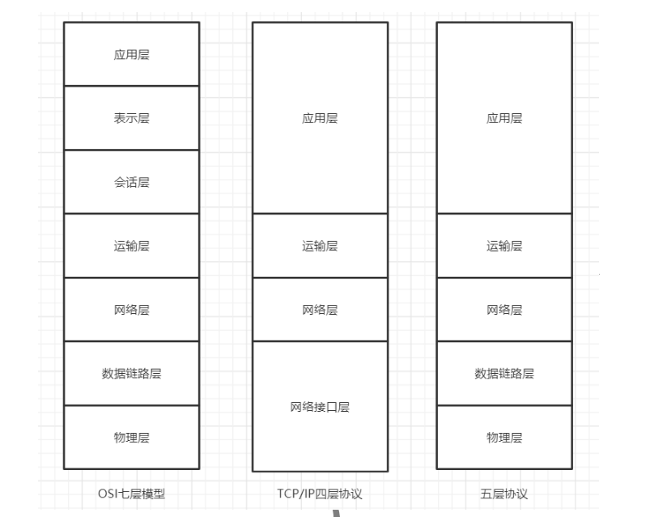
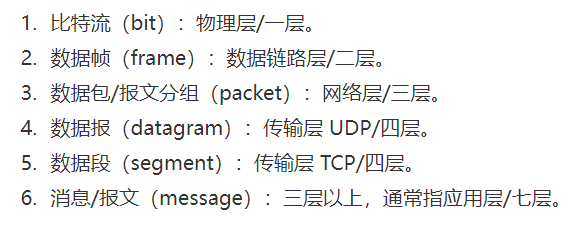
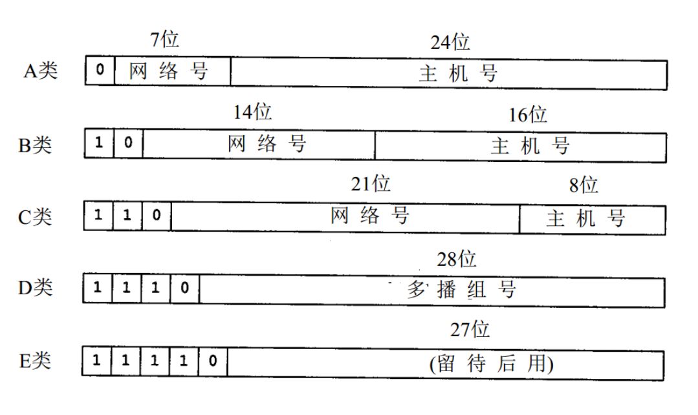
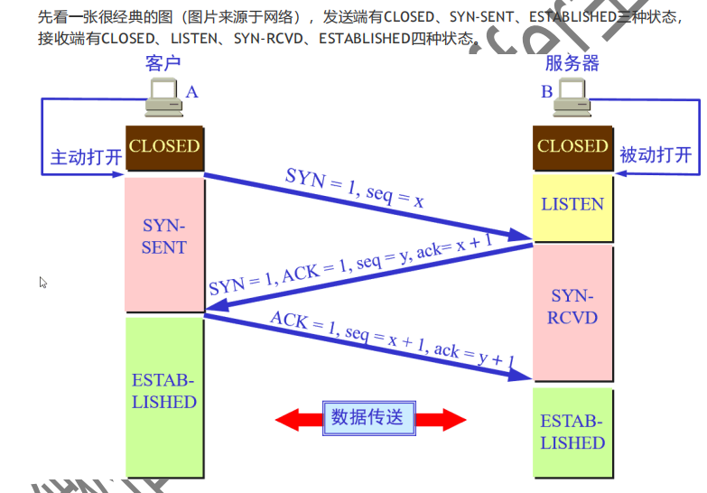
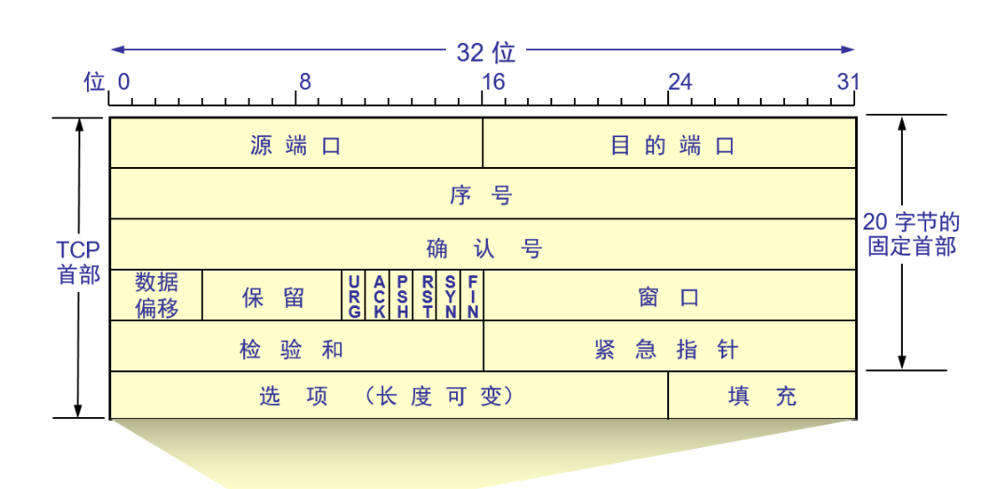

### 什么是网络协议，为什么要对网络协议分层

网络协议是计算机在通信过程中要遵循的一些约定好的规则。

网络分层的原因：

​	易于实现和维护，因为各层之间是独立的，层与层之间不会收到影响。

​	有利于标准化的制定，支持异构网络的互联互通。

### 计算机网络模型

**应用层**
应用层的任务是通过应用进程之间的交互来完成特定的网络作用。

常见的应用层协议有域名系统 DNS，HTTP协议等。 

**表示层**
表示层的主要作用是数据的表示、安全、压缩。可确保一个系统的应用层所发送的信息可以被另一个系统的应用层读取。 

**会话层**
会话层的主要作用是建立通信链接，保持会话过程通信链接的畅通，同步两个节点之间的对话，决定通信是否被中断以及通信中断时决定从何处重新发送。

**传输层**
传输层的主要作用是负责向两台主机进程之间的通信提供数据传输服务。

传输层的协议主要有传输控制协议TCP和用户数据协议UDP。 

**网络层**
网络层的主要作用是：将传输层传下来的报文段封装成报文分组，选择合适的网间路由和交换结点，确保数据及时送达。

常见的协议有IP协议。

所实现的硬件：路由器

**数据链路层**
数据链路层的作用是在物理层提供比特流服务的基础上，建立相邻结点之间的数据链路，实现将网络层下发的分组封装成帧、差错检验、透明传输。

常见的协议有 SDLC、HDLC、PPP等。 

所实现的硬件：交换机（识别mac地址并转发数据帧）、网桥

**物理层**
物理层的主要作用是实现相邻计算机结点之间比特流的透明传输，并尽量屏蔽掉具体传输介质和物理设备的差异。

所实现的硬件：集线器，中继器

**各层的传输单元**

[怎么区分网络协议中各层的传输单位 - 掘金 (juejin.cn)](https://juejin.cn/post/6844903929579307015)

### 网络层分组交换的两种形式

数据报和虚电路；

虚电路服务在源、目的主机通信之前,应先建立一条虚电路,然后才能进行通信，通信结束应将虚电路拆除；中继结点是不能根据流量情况来改变分组的传送路径的；

分组作为一个独立的信息单位传送，不需建立和释放连接,目标结点收到数据后也不需发送确认，传输过程中，中继结点可为数据报选择一条流量较小的路由，而避开流量较高的路由；

### IP分类？IP为什么要分类？

IP分类可以限定拥有相同网络地址的终端都在同一个范围内，那么路由表只需要维护这个网络地址的方向，就可以找到相应的终端了。

### URI和URL的区别

URI：中文全称为统一资源标志符，主要作用是唯一标识一个资源。

URL：中文全称为统一资源定位符，主要作用是提供资源的路径。

是URI像是身份证，可以唯一标识一个人，而URL更像一个住址，可以通过URL找到这个人。

### 有了MAC地址，为什么还要用IP地址？只用IP，不用MAC行不行？

只用IP而不用MAC理论上是可行的，但是为了向下兼容，不进行替换；

### ping是什么

ping是ICMP(网际控制报文协议)中的一个重要应用，ICMP是网络层的协议。ping的作用是测试两个主机

的连通性。

ping的工作过程：

向目的主机发送多个ICMP回送请求报文；

根据目的主机返回的回送报文的时间和成功响应的次数估算出数据包往返时间及丢包率；

### TCP与UDP的区别

|      | 是否面向连接 | 可靠性 | 传输形式 | 传输效率 | 应用场景      | 首部字节 | 通信方式                                 |
| ---- | ------------ | ------ | -------- | -------- | ------------- | -------- | ---------------------------------------- |
| TCP  | 面向连接     | 可靠   | 字节流   | 低       | 文件/邮件传输 | 20-60    | 全双工、只能点对点                       |
| UDP  | 无连接       | 不可靠 | 报文     | 高       | 视频/语音传输 | 8        | 一对一，一对多，多对一和多对多的交互通信 |

TCP面向字节流的含义：不保证接收方应用程序受到的数据块与发送方应用程序发送的数据块，具有对应大小的关系，但是他们的字节流是一致的。

UDP面向数据报的含义：UDP对于应用层下来的报文，不合并也不拆分，而是保留报文的边界交给IP层，由IP层进行分片。

TCP面向连接的含义：一个应用进程向另外一个应用进程发送数据之前，两个进程必须先要握手，初始化一些建立连接的TCP状态变量，通信期间通过这些变量来维护各个分组间的状态。它的连接状态完全保留在两个端系统中，中间元素不会维持TCP连接状态。而对于面向无连接的UDP来说，各个分组独立于其它分组。

### TCP如何保证可靠运输

**1、校验和：**在发送算和接收端分别计算数据的校验和，如果两者不一致，则说明数据在传输过程中出

现了差错，接收端将丢弃和不确认此报文段。

**2、序列号：**TCP会对每一个有效的字节进行编号，接收方接到数据后，会对发送方发送确认应答(ACK

报文)，并且这个ACK报文中带有相应的确认编号，告诉发送方，下一次发送的数据从编号多少开始

发。接受放可以通过序列号，保证数据是按序完整到达的。

[理解TCP序列号（SequenceNumber）和确认号（AcknowledgmentNu。。。 - 百度文库 (baidu.com)](https://wenku.baidu.com/view/abaa599e950590c69ec3d5bbfd0a79563c1ed4fa.html)

**3、超时重传机制：**

停止等待ARQ：发送方维护一个重传计时器，如果在发送数据后一段时间内没有收到确认序号ACK，那么发送方就会重新发送数据。

连续ARQ：发送方维持一个发送窗口，凡位于发送窗口内的分组可以连续发送出去，而不需要等待对方确认。接收方一般采用累积确认，对按序到达的最后一个分组发送确认，表明到这个分组为止的所有分组都已经正确收到了。

**4、连接管理：**

**三次握手：**

（1）简述SYN攻击：

服务器端的资源分配是在二次握手时分配的，而客户端的资源是在完成三次握手时分配的，在 TCP 连接的过程中，服务器的内核实际上为每个 Socket 维护了两个队列：

一个是还没完全建立连接的队列，称为 TCP 半连接队列，这个队列都是没有完成三次握手的连接，此时服务端处于 syn_rcvd 的状态；

另一个是建立连接的队列，称为 TCP 全连接队列，这个队列都是完成了三次握手的连接，此时服务端处于 established 状态；

SYN攻击即利用TCP协议缺陷，Client在短时间内伪造大量不存在的IP地址，并向Server不断地发送SYN包，占用半连接队列，导致正常的SYN请求因为队列满而被丢弃，从而引起网络拥塞甚至系统瘫痪。

优化方式：缩短SYN Timeout时间；记录IP，若连续受到某个IP的重复SYN报文，从这个IP地址来的包会被一概丢弃。

（2）为什么是3次，两次可不可以？

假设可以，如果第二次握手时，服务端返回给客户端的确认报文丢失了，客户端这边认为服务端没有和他建立连接，而服务端却以为已经和客户端建立了连接，并且可能向服务端已经开始向客户端发送数据，但客户端并不会接收这些数据，浪费了资源。

三次握手还有一个好处：如果服务端接收到了一个早已失效的来自客户端的连接请求报文，会向客户端发送确认报文同意建立TCP连接。但因为客户端并不需要向服务端发送数据，所以客户端通过不进行第三次握手来告知服务端此次连接无效。

（3）如果已经建立连接，但是客户端突然出现故障了怎么办？

TCP有一个保活机制。定义⼀个时间段，在这个时间段内，如果没有任何连接相关的活动，TCP 保活机制会开始作⽤，每隔⼀个时间间隔，发送⼀个探测报⽂，该探测报⽂包含的数据⾮常少，如果连续⼏个探测报⽂都没有得到响应，则认为当前的TCP 连接已经死亡。

**四次挥手：**

（1）为什么连接是3次，关闭的时候确实4次

因为需要确保通信双方都能通知对方释放连接，假设客服端发送完数据向服务端发送释放连接请求，当客服端并不知道，服务端是否已经发送完数据，所以此次断开的是客服端到服务端的单向连接，服务端返回给客户端确认报文后，服务端还能继续单向给客户端发送数据。当服务端发送完数据后还需要向客户端发送释放连接请求，客户端返回确认报文，TCP连接彻底关闭。所以断开TCP连接需要客户端和服务端分别通知对方并分别收到确认报文，一共需要四次。

（2）TIME_WAIT和CLOSE_WAIT的区别在哪？

CLOSE_WAIT是被动关闭形成的，当客户端发送FIN报文，服务端返回ACK报文后

进入CLOSE_WAIT。

TIME_WAIT是主动关闭形成的，当第四次挥手完成后，客户端进入TIME_WAIT状态。

（3）为什么要等2MSL才能释放TCP连接

MSL的意思是报文的最长寿命，可以从两方面考虑：

客户端发送第四次挥手中的报文后，再经过2MSL，可使本次TCP连接中的所有报文全部消失，不

会出现在下一个TCP连接中；

考虑丢包问题，如果第四挥手发送的报文在传输过程中丢失了，那么服务端没收到确认ack报文就

会重发第三次挥手的报文。如果客户端发送完第四次挥手的确认报文后直接关闭，而这次报文又恰

好丢失，则会造成服务端无法正常关闭；

（4）有大量的TIME_WAIT状态怎么解决

time_wait 状态的影响：TCP 连接中，主动发起关闭连接的一端，会进入 time_wait 状态，time_wait 状态，默认会持续 2 MSL（报文的最大生存时间），在这段时间，TCP 连接占用的端口，无法被再次使用。

解决办法：

客户端，HTTP 请求的头部，connection 设置为 keep-alive，保持存活一段时间：现在的浏览器，一般都这么进行了 。

服务器端

a. 允许 time_wait状态的 socket 被重用

b. 缩减 time_wait 时间

**5、流量控制：**

如果发送端发送的数据太快，接收端来不及接收就会出现丢包问题。为了解决这个问题，TCP协议利用了滑动窗口进行了流量控制。在TCP首部有一个16位字段大小的窗口，窗口的大小就是接收端接收数据缓冲区的剩余大小。接收端会在收到数据包后发送ACK报文时，将自己的窗口大小填入ACK中，发送方会根据ACK报文中的窗口大小进而控制发送速度。如果窗口大小为零，发送方会停止发送数据。

（滑动窗口的单位是字节）

**6、拥塞控制：**

看pdf

### ARP工作流程

看pdf

### DNS

DNS是因特网上作为域名和IP地址相互映射的一个分布式数据库，能够使用户更方便的去访问互联网而不用去记住能够被机器直接读取的IP地址。

**DNS是集群式的工作方式还是 单点式的，为什么？**

是集群式的，很容易想到的一个方案就是只用一个DNS服务器，包含了所有域名和IP地址的映射。尽管这种设计方式看起来很简单，但是缺点显而易见，如果这个唯一的DNS服务器出了故障，那么就全完了，因特网就几乎崩了。为了避免这种情况出现，DNS系统采用的是分布式的层次数据数据库模式，还有缓存的机制也能解决这种问题。

**工作流程**

主机向本地域名服务器的查询一般是采用递归查询，而本地域名服务器向根域名的查询一般是采用迭代查询。

首先主机会查客户端的DNS缓存，依次为浏览器缓存、系统缓存(Hosts文件)、路由器缓存；

都查不到则递归向本地DNS服务器查，他首先查自己的DNS缓存，如果没有就向根域名服务器查，根域名服务器告诉本地域名服务器去哪个顶级域名服务器找，顶级域名服务器告诉本地域名服务器去哪个权限域名服务器找，最后本地域名服务器将结果缓存并返回给主机；

（权限域名服务器是负责一个区的域名服务器，区比域的划分要小）

##### **DNS区域传输的时候使用TCP协议：**

1.辅域名服务器会定时（一般3小时）向主域名服务器进行查询以便了解数据是否有变动。如有变动，会执行一次区域传送，进行数据同步。区域传送使用TCP而不是UDP，因为数据同步传送的数据量比一个请求应答的数据量要多得多。

2.TCP是一种可靠连接，保证了数据的准确性。

**域名解析时使用UDP协议**

[(108条消息) DNS用的是TCP协议还是UDP协议_信小呆的博客-CSDN博客_dns是tcp还是udp](https://blog.csdn.net/qq_32273965/article/details/106749796)

### 转发和重定向的区别

转发是服务器行为。服务器直接向目标地址访问URL,将相应内容读取之后发给浏览器，用户浏览器地址栏URL不变，转发页面和转发到的页面可以共享request里面的数据。
重定向是利用服务器返回的状态码来实现的，如果服务器返回301或者302，浏览器收到新的消息后自动跳转到新的网址重新请求资源。用户的地址栏url会发生改变，而且不能共享数据。

### 了解REST API吗

REST API全称为表述性状态转移（Representational State Transfer，REST）即利用HTTP中get、post、put、delete以及其他的HTTP方法构成REST中数据资源的增删改查操作：
Create ：POST
Read ：GET
Update ：PUT/PATCH
Delete：DELETE

### ip报文

以太网帧的数据部分的最大长度叫MTU，一个MTU最大是1500字节，那么最多包含多少的数据
ip头部字节大小为20~60，最多数据即1500-20=1480

##### tcp如何最大程度利用带宽

MSS是TCP数据包每次能够传输的最大数据分段，其中并不包括TCP首部。MSS的值在ip不分片的情况会越大越好，如果ip分片了，那么某一个分片丢失会导致其它分片必须重传（MSS值是MTU减去IP和TCP首部长度）。

### Socket与TCP和UDP的联系

1、TCP将连接的端点抽象为socket，也就是套接字，IP+端口号，每一条TCP连接唯一地被通信两端的两个套接字所确定。

2、Socket是应用层与TCP/IP协议族通信的中间软件抽象层，把复杂的TCP/IP协议的实现隐藏起来，为用户提供了一组接口，它定义了许多函数或例程，用以开发TCP/IP网络上的应用程序，用socket可以创建tcp连接，也可以创建udp连接。

3、在操作系统内核，socket是以文件的形式存在的（见Linux的网络模型）；

### TCP与UDP中Socket的区别

创建socket()的时候可以指定domain、type、protocol；

domain表示协议域/协议簇（用什么协议簇来确定传输的目标地址，比如使用IPV4和16位端口组合）；type表示socke的类型（比如流失套接字Stream和数据报套接字Dgram）；protocol表示传输协议（与type配合，TCP和UDP等）

### 传输视频用udp还是tcp？

视频属于多媒体数据，传输多媒体数据，隐含了边传输边播放的意思，这对时延（传送到网络的另一端的用时）和时延抖动（每一个分组的时延都是不同的）有较高要求，TCP会对出错或丢失的分组进行重传，时延会大大增加，同时对于一些实时数据，比如视频会议等，具有丢失容忍性；

### cookie和session和token和jwt的区别

- cookie 存储在客户端：cookie 是服务器发送到用户浏览器并保存在本地的一小块数据，它会在浏览器下次向同一服务器再发起请求时被携带并发送到服务器上。

- session 存储在服务器端，它实现的一种方案是cookie，sessionId 会被存储到客户端的cookie 中。服务端根据sessionId找存在服务端的session

- token组成： 用户唯一身份标识、time: 当前时间的时间戳、sign: 签名以防止第三方恶意拼接、固定参数(可选): 将一些常用的固定参数加入到 token 中是为了避免重复查库，流程。。。

  （客户端在浏览器第一次访问服务端时，服务端生成的一串字符串作为Token发给客户端浏览器，下次浏览器在访问服务端时携带token即可无需验证用户名和密码）

- 由于session不利于多机分布，因此可以将session中这个用户的信息加密存储在token中，服务端就不需要存储session。

- 这个方案叫做JWT。JWT由3部分组成，Header :描述 JWT 的元数据。定义了生成签名的算法以及 Token 的类型。Payload（负载）:用来存放实际需要传递的数据Signature（签名）：服务器通过Payload、Header和一个密钥(secret)使用 Header 里面指定的签名算法（默认是 HMAC SHA256）生成。

### 如果客户端禁止cookie，session还能用吗？

可以，Session的作用是在服务端来保持状态，通过sessionid来进行确认身份，但sessionid一般是通过

Cookie来进行传递的。如果Cooike被禁用了，可以通过在URL中传递sessionid。

### 运输层的分用与复用

复用是指在发送方不同的应用进程都可以使用同一个运输层协议传送数据，分用指的是接收方的运输层在剥去报文的首部后能够把这些数据正确交付目的应用进程。

### 用通俗的例子讲解TCP

[【俗话说】换个角度理解TCP的三次握手和四次挥手 - SegmentFault 思否](https://segmentfault.com/a/1190000021905352)

HTTP状态码

小林coding

### Http是什么？

HTTP是⼀个在计算机世界⾥专⻔在「两点」（中间存在中转或接力）之间「传输」⽂字、图⽚、⾳频、视频等「超⽂本」数据的「约定和规范」。

### HTTP字段(x)

**User-Agent：**

产生请求的浏览器类型。

**Accept：**

客户端可识别的内容类型列表。

**HOST域：**

客户端发送请求时，⽤来指定服务器的域名。

***Content-Length* 字段：**

服务器在返回数据时，会有 Content-Length 字段，表明本次回应的数据⻓度。

**Connection 字段：**

Connection 字段最常⽤于客户端要求服务器使⽤ TCP 持久连接，以便其他请求复⽤。

***Content-Type* 字段：**

Content-Type 字段⽤于服务器回应时，告诉客户端，本次数据是什么格式。（Content-Type: text/html; charset=utf-8）；

客户端使用Accept 字段来声明自己可以接受哪些数据格式（Accept: */*）

***Content-Encoding* 字段：**

表示服务器返回的数据使⽤了什么压缩格式；

客户端请求的时候用Accept-Encoding说明可以接受哪些压缩方法

### IP报文头部

[(15条消息) IP、TCP、UDP报文头说明_Mr. Sun_的博客-CSDN博客_ip报文头](https://blog.csdn.net/sj349781478/article/details/122398294)

### TCP头部（最少20个字节）

### UDP头部（8个字节）

### **HTTP报文结构**

- **“起始行 + 头部 + 空行 + 实体”** 

1. 起始行（start line）：请求行或是状态行  
   1. 请求行格式：“请求方法 目标URI 协议版本号” 
   2. 状态行格式：“协议版本号 状态码 原因” 
2. 头部（header）：使用 key-value 详细说明报文； 
3. 消息体（entity）：实际传输的数据 

- HTTP 报文必须有 起始行和头部，在 header 之后必须要有一个 空行，可以没有 消息体

### HTTP特性

优点：

灵活易于扩展：HTTP协议⾥的各类请求⽅法、URI/URL、状态码、头字段等每个组成要求都没有被固定死，都允许开发⼈员⾃定义和扩充。

缺点：

无状态：⽆状态的好处，因为服务器不会去记忆 HTTP 的状态，所以不需要额外的资源来记录状态信息，这能减轻服务器的负担，能够把更多的 CPU 和内存⽤来对外提供服务。⽆状态的坏处，既然服务器没有记忆能⼒，它在完成有关联性的操作时会⾮常麻烦。（解决）

明文传输：会将重要信息暴漏出来。（解决）

不安全：通信不加密，不对通信方身份验证，无法证明报文的完整性。

### HTTP的演变

##### HTTP/1.1 相⽐ HTTP/1.0 性能上的改进：

使⽤ TCP ⻓连接的⽅式改善了 HTTP/1.0 短连接造成的性能开销。长连接是指不在需要每次请求都重新建立一次连接，HTTP 1.0默认使用短连接，每次请求都要重新建立一次TCP连接，资源消耗较大。

⽀持管道⽹络传输，只要第⼀个请求发出去了，不必等其回来，就可以发第⼆个请求出去，可以减少整体的响应时间。但是服务器还是按照顺序回应请求，因此会存在队头阻塞，也就是某一个请求的响应被阻塞了，后面排队的也会被阻塞。

（x）更多的缓存处理策略：在HTTP 1.0中主要使用header中的If-Modified-Since,Expires作为缓存判断的标准，HTTP 1.1引入了Entity tag，If-Unmodified-Since, If-Match等更多可供选择的缓存头来控制缓存策略。

HOST域 ：在HTTP 1.0 中认为每台服务器都会绑定唯一的IP地址，所以，请求中的URL并没有传递主机名。但后来一台服务器上可能存在多个虚拟机，它们共享一个IP地址，所以HTTP 1.1中请求消息和响应消息都应该支持Host域。

断点续传：1.0中如果请求被中断，则必须重新再次发送，对于大文件的下载和传输不友好；1.1引入了range域，支持只请求资源的某个部分（状态码为206），并且它支持断点续传，也就是这一部分传输垮掉了，不需要重新请求前面成功的部分。

##### HTTP2.0的新特性：

header压缩：在HTTP 1.x中，header携带大量信息，并且每次都需要重新发送，在HTTP 2.0中，通信双方各自缓存一份header fields表，对应一个索引号，如果字段重复或者相似，只发送索引号，避免了header的重复传输。

新的二进制格式：HTTP 1.x的纯文本形式的报文，HTTP 2.0报文是二进制格式的（头信息帧和数据帧），这样就收到报文后就不需要将文本转换成二进制，而是直接解析。

服务端推送：客户端在请求一个资源时，会把相关资源一起发给客户端（比如可能用到的js或css文件），这样客户端就不需要再次发起请求。

多路复用：HTTP2的每个请求或回应的所有数据包，称为⼀个数据流，每个数据流都标记着⼀个独⼀⽆⼆的编号，因此可以在⼀个连接中并发多个请求或回应，⽽不⽤按照顺序⼀⼀对应，因此不会出现队头阻塞问题。 

##### HTTP3.0：

##### 基于TCP的传输问题：

HTTP/1.1 中的管道（ pipeline）传输中如果有⼀个请求阻塞了，那么队列后请求也统统被阻塞住了

HTTP/2 多个请求复⽤⼀个TCP连接，⼀旦发⽣丢包，就会阻塞住后续的所有的 HTTP 请求。

##### 基于UDP的QUIC解决：

它保证了传输的可靠性的同时，当某个流发生丢包时，只会阻塞这个流，其它流不会受到影响。（普及得慢，很多网络设备不支持QUIC，只会当作UDP）

### 在浏览器输入url地址到显示主页的过程

 对输入到浏览器的url进行DNS解析，将域名转换为IP地址

 和目的服务器建立TCP连接

 向目的服务器发送HTTP请求

 服务器处理请求并返回HTTP报文

 浏览器解析并渲染页面

### Servlet是线程安全的吗？

Servlet不是线程安全的，多线程的读写会导致数据不同步的问题。

### 通信安全的四个必要条件

机密性：是指对数据的“保密”，只能由可信的人访问，对其他人是不可见的秘密；

完整性：是指数据在传输过程中没有被修改，使用摘要算法解决（哈希函数将数据转换为固定长度的字符串，这是一种单向函数，要找到两个不同的报文有相同的散列输出，在计算上是不可行的）。

端点鉴别：鉴别信息的发送方和接收方的真实身份。可以使用数字签名解决（私钥加密，公钥解密），由于非对称加密效率低，可以仅加密摘要。

运行的安全性：对访问网络的权限加以控制。

### TCP粘包

TCP粘包就是指发送方发送的若干包数据到达接收方时粘成了一包，从接收缓冲区来看，后一包数据的头紧接着前一包数据的尾，出现粘包的原因是多方面的，可能是来自发送方，也可能是来自接收方。

原因：

发送方原因

TCP默认使用Nagle算法，为了减少网络中报文段的数量，会收集多个小分组，在一个确认到来时一起发送。可能会出现粘包问题

接收方原因

TCP接收到数据包时，并不会马上交到应用层进行处理，或者说应用层并不会立即处理。而是保存在接收缓存里，然后应用程序主动从缓存读取收到的分组。这样一来，如果TCP接收数据包到缓存的速度大于应用程序从缓存中读取数据包的速度，多个包就会被缓存，应用程序就有可能读取到多个首尾相接粘到一起的包。

解决：

发送方关闭Nagle算法；

接受方在应用层解决：

1. 格式化数据：每条数据有固定的格式（开始符，结束符），这种方法简单易行，但是选择开始符和结束符时一定要确保每条数据的内部不包含开始符和结束符。
2. 发送长度：发送每条数据时，将数据的长度一并发送，例如规定数据的前4位是数据的长度，应用层在处理时可以根据长度来判断每个分组的开始和结束位置。

**udp会产生粘包问题吗？**

UDP则是面向消息传输的，是有保护消息边界的，接收方一次只接受一条独立的信息，所以不存在粘包问题。

### 什么是对称加密与非对称加密

**对称加密**

对称加密指加密和解密使用同一密钥，优点是运算速度快，缺点是如何安全将密钥传输给另一方。常见的对称加密算法有DES、AES等等。

**非对称加密**

非对称加密指的是加密和解密使用不同的密钥，一把公开的公钥，一把私有的私钥。公钥加密的信息只有私钥才能解密，私钥加密的信息只有公钥才能解密。优点解决了对称加密中存在的问题。缺点是运算速度较慢。常见的非对称加密算法有RSA、DSA、ECC等等。

### GET和POST的区别

作用：

GET用于获取资源，POST用于传输实体主体；

参数位置：

GET的参数放在URL中，POST的参数存储在实体主体中，并且GET方法提交的请求的URL中的数据

做多是2048字节，POST请求没有大小限制；

安全性：

安全是指请求方法不会破坏服务器上的资源。GET是「只读」操作，无论操作多少次，服务器上的数据都是安全的；POST是新增或提交数据,会修改服务器上的资源，所以是不安全的。

幂等性：

GET方法是具有幂等性的，而POST方法不具有幂等性。这里幂等性指客户端连续发出多次请求，收到的结果都是一样的；

### TLS/SSL握手过程（TCP三次握手后）（HTTPS用443端口）

1. **"client hello"消息：**客户端通过发送"client hello"消息向服务器发起握手请求，该消息包含了客户端所支持的 TLS 版本和密码组合以供服务器进行选择，还有一个"client random"随机字符串。（上面所说的密码组合主要有密钥交换期间的非对称加密算法以及握手完成后的对称加密算法以及信息摘要算法）
2. **"server hello"消息：**服务器发送"server hello"消息对客户端进行回应，该消息包含了数字证书，服务器选择的密码组合和"server random"随机字符串。（数字证书的生成主要是服务器将公钥交给认证机构，CA将它合并到数字证书中，CA为了保证信息的完整性以及证明自己的身份，会得到摘要信息，并用自己的私钥加密）
3. **验证：**客户端对服务器发来的证书进行验证，确保对方的合法身份。（在验证过程中，客户端用CA的公钥（一般内置在浏览器或操作系统中）解密数字签名，得到摘要信息，然后使用相同的信息摘要算法计算证书的摘要信息，进行信息完整性的校验）
4. **"premaster secret"字符串：**客户端向服务器发送另一个随机字符串"premaster secret (预主密钥)"，这个字符串是经过服务器的公钥加密过的，只有对应的私钥才能解密。
5. **使用私钥：**服务器使用私钥解密"premaster secret"。
6. **生成共享密钥**：客户端和服务器均使用 client random，server random 和 premaster secret，并通过相同的算法生成相同的共享密钥 **KEY**。
7. **客户端就绪：**客户端发送经过共享密钥 **KEY**加密过的"finished"信号。
8. **服务器就绪：**服务器发送经过共享密钥 **KEY**加密过的"finished"信号。
9. **达成安全通信：**握手完成，双方使用对称加密进行安全通信。

[HTTPS详解二：SSL / TLS 工作原理和详细握手过程 - SegmentFault 思否](https://segmentfault.com/a/1190000021559557)

对称加密算法主要有DES等

信息摘要算法主要有MD5等

非对称加密算法主要有RSA等

##### 验证的过程中会存在一个证书链

操作系统或浏览器会内置一些根证书；

比如baidu.com证书发过来时，会发现这个证书的签发者不是根证书，就无法根据，本地根证书中的公钥去验证baidu.com证书是否可信，于是客户端会根据baidu.com证书的签发者，请求中间证书，收到后，发现中间证书是由根证书签发的，那么就会用根证书的公钥去验证中间证书的身份，通过后，中间证书可信，然后用中间证书的公钥去验证baidu.com的证书的可信性，通过就信任baidu.com证书。于是形成了一个信任链。

（确保根证书的绝对安全，将它重重隔离起来，不然如果根证书失守了，整个信任链都会有问题）

### CA证书的签发过程（待看）

[证书生成过程及自建CA(一) - 简书 (jianshu.com)](https://www.jianshu.com/p/f9ae89ff296b)

### 内网与外网与专用网

公有IP：全球唯一，通过它直接访问因特网；

私有IP：专门为组织机构内部使用，只在机构内部有效，不能直接上网；使用私有IP缓解了IP地址分配不足的问题；

内网：也就是局域网，由同一个路由器相连，局域网中的每个ip都是互异的，这个IP只在局域网内有效，如果电脑要访问互联网，需要通过ISP分配的外网的IP地址；

外网：互联网

专用网：采用私有IP的互联网络是专用网（专用网内可以有多个局域网）；专用网有两种实现方式：一种是租用专门的线路供机构内部通信；另一种是VPN，它利用公网作为传输的载体，对传输的数据进行加密；

网络地址转换NAT：专用网内的主机需要访问外网，需要将本地地址转换成全球IP地址；同样，当收到互联网上主机的数据报的时候，要进行IP地址转换，正确地发送到专用网内的某一台主机上；

NAT的一种实现方式是端口映射，多个专用网内的主机公用一个外网IP，通过端口标识不同的主机；

##### 内网和外网通信过程

路由器有两种接口：WAN 口和 LAN 口。WAN口接外部 IP 地址用，通常指的是出口，转发来自内部 LAN 接口的 IP 数据包，这个口的 IP 是唯一的。LAN口接内部 IP 地址用，LAN 内部是交换机。

当我们上百度的时候，经过路由器的 wan口，进行相应的IP、端口转化：192.168.31.11:80 -> 10.221.0.24:8080；

最后，经过运营商，运营商那边会做相应的端口映射（而且是动态端口映射），子网 IP（10.221.0.24:8080）转化为公网 IP（128.0.0.1:8888），通过这个公网 IP 去访问百度服务器。

[(108条消息) 计算机网络常见面试真题详解_Redemption&的博客-CSDN博客](https://blog.csdn.net/Redemption___/article/details/122352663)

### DHCP

动态主机配置协议，提供了允许主机加入新的网络以及获取IP地址而不用手动配置的机制；基于UDP，采用客户服务器模式

实现：

每一个网络有一个DHCP中继代理，需要IP地址的主机在局域网内广播发现报文（目的IP为全1，源为全0），局域网内其它主机收到不理会，DHCP中继代理收到后，以单播形式向DHCP服务器转发这个报文，收到DHCP服务器的应答报文后，再发回给主机；

### 在浏览器中输入 url 地址 ->> 显示主页的过程

1. 对输入到浏览器的url进行DNS解析，将域名转换为IP地址。

2. 和目的服务器建立TCP连接

3. 向目的服务器发送HTTP请求

4. 服务器处理请求并返回HTTP报文

5. 浏览器解析并渲染页面

### 网络层能够看到端口？

运输层的报文头部中包含有端口号，运输层的报文下来会作为数据部分，被网络层加上IP报文头，IP报文头不包含端口号，但是可以分析IP报文的数据部分得到端口号

### Linux收发网络包的流程

**收包流程**

- 网卡接收到网络包后通过DMA技术，将网络包放到Ring Buffer里边（一个环形缓冲区）；

- 网卡发起 硬件中断 ，唤醒 软中断 来轮询处理数据。软中断的处理流程：

  从Ring Buffer拷贝数据到内核缓冲区，由网络协议栈对它进行逐层处理；

  网络接口层检查报文的合法性，去掉帧头帧尾交给网络层

  网络层判断是交给上层处理还是转发出去，然后看是TCP协议还是UDP，接着去掉IP头，交给传输层

  传输层根据「源 IP、源端⼝、⽬的 IP、⽬的端⼝」 找到对应的Socket，把数据拷贝到Socket的接收缓冲区

- 应用层调用Socket的接口（对应poll、epoll），从内核Socket接收缓冲区读取数据到应用层

**发包流程**

通过调用系统调用，陷入到内核态的Socket层，将应用层的数据拷贝到Socket发送缓冲区；

加上TCP或UDP包头，交给网络层；

网络层加上IP头，查询路由表确定下一跳的IP，按照MTU分片；

在网络接口层，通过下一跳IP以及ART协议获得MAC地址，加上帧头和帧尾，放到发包队列中；

触发软中断，告诉网卡驱动程序，它通过DMA，将网络包从发包队列放到硬件网卡队列，最后网卡将它发出去；

##### 软中断？

那 Linux 系统为了解决中断处理程序执⾏过⻓和中断丢失的问题，将中断过程分成了两个阶段，分别是

「上半部和下半部分]；

上半部分用来快速处理中断，以硬中断的方式进行；

下半部分用来延迟处理上半部未完成的工作（内核触发软中断，以内核线程的方式运行）

### 服务端Socket的最大连接数

[网络通信socket连接数上限 - 爱码网 (likecs.com)](https://www.likecs.com/show-205228606.html)

### 路由选择协议？

**是什么**

它是一种网络层协议，通过协议规定路由器之间进行通信来分享和维护自己的路由表中的信息；维护了路由表信息之后，就可以确定最佳的路由选择路径；路由器之间的信息分享可以了解非直连网络的状态，当网络状态发什么变化的时候，路由表中的信息也应该相应的更新。

**自治系统AS**

许多单位不想让别人了解本公司自治域内的网络的使用的具体协议细节，但是又希望连接到因特网中，因此有了自治系统AS，它是由同一个管理机构管理的；

AS内部路由选择协议使用的是内部网关协议；外部用的是外部网关协议；

**内部网关协议**

RIP：基于距离向量，路由器仅和相邻路由器交换自己的路由表，经过若干次交换之后，所有路由器最终会知道到达本自治系统中任何一个网络的最短距离和下一跳路由器地址。缺点是当网络出现故障时，要经过比较长的时间才能将此消息传送到所有路由器

OSPF：所有路由器都具有全网的拓扑结构图，并且是一致的；路由器会向本自治系统中的所有路由器发送信息，这种方法是洪泛法；相比RIP，OSPF收敛得更快。

**外部网关协议**

BGP：BGP 只能寻找一条比较好的路由，而不是最佳路由，这是因为每个AS采用不同的路由选择协议，而且一些策略不同（比如有些AS不愿意让其它AS经过）；每个 AS 都必须配置 BGP 发言人，通过在两个相邻 BGP 发言人之间建立 TCP 连接来交换路由信息

### 网络攻击

**XSS攻击**

攻击者往Web页面里插入恶意Script代码，当用户浏览该页之时，嵌入其中Web里面的Script代码会被执行，从而达到恶意攻击用户的目的。

分为三种

反射型xss攻击：用户主动的去访问带攻击的链接，网站给受害者的返回中包含了来自URL的恶意文本，浏览器执行页面代码；

存储型xss攻击：恶意代码会被存储在数据库中，其他用户在正常访问的情况下，也有会被攻击，影响的范围比较大。

DOM型xss攻击：反射性攻击的变种，服务器返回的页面是正常的，只是我们在页面执行js的过程中，会把攻击代码植入到页面中。

防御：

- 编码，就是转义用户的输入，把用户的输入解读为数据而不是代码
- 校验，对用户的输入及请求都进行过滤检查，如对特殊字符进行过滤，设置输入域的匹配规则等。
- 限制入参长度
- 设置cookie httponly为true。支持HttpOnly的浏览器检测到包含HttpOnly标志的cookie，并且客户端脚本代码尝试读取该cookie，则浏览器将返回一个空字符串作为结果，防止了读取cookie的信息

**CSRF**

受害者访问了攻击者的网站后，被动地发送攻击者伪造的请求，利用受害者的cookie通过网站的认证。

防御：

- 验证 HTTP Referer 字段。Referer记录了该 HTTP 请求的来源地址
-  使攻击者就无法伪造用户的请求，比如在 HTTP 头中自定义属性并验证、在请求地址中添加 token 并验证。

**DDos攻击**

攻击者控制了位于不同位置的多台机器并利用这些机器对受害者同时实施攻击（攻击的发出点是分布在不同地方的），大量的服务请求消耗了受害者的网络带宽或系统资源，而导致无法向用户提供正常服务。

参考[pdai的安全相关详解](https://pdai.tech/md/develop/security/dev-security-overview.html)

**DNS劫持**

攻击者篡改DNS解析设置，将域名由正常IP指向由攻击者控制的非法IP，就会导致我们访问域名打开的却不是对应的网站，而是一个不可达或者假冒的网站

**ARP欺骗**

攻击者把虚假的IP-MAC映射关系通过ARP报文发给主机，让主机把虚假的IP-MAC映射存入ARP缓存表，让受害者其无法正确发送数据。

### 比较好的资料

[如果让你来设计网络 (qq.com)](https://mp.weixin.qq.com/s/jiPMUk6zUdOY6eKxAjNDbQ)

[有了 IP 地址，为什么还要用 MAC 地址？ - 知乎 (zhihu.com)](https://www.zhihu.com/question/21546408)

[(108条消息) 计算机网络常见面试真题详解_Redemption&的博客-CSDN博客](https://blog.csdn.net/Redemption___/article/details/122352663)